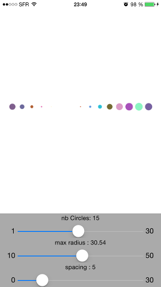
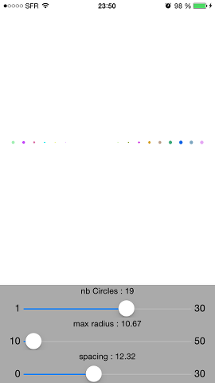

## MAActivityIndicator

 

MAActivityIndicator is a custom activity indicator with little dots written in Swift. 
All the credit goes to [mownier](https://github.com/mownier/) for the [original indicator view](https://github.com/mownier/MONActivityIndicatorView) in objective C.

----

**Licence :**
MAActivityIndicator is under MIT Licence so you can use/modify it as you wish. Any feedback will be appreciated.

Any comments are welcomed 

@micazeve
micazeve@gmail.com
